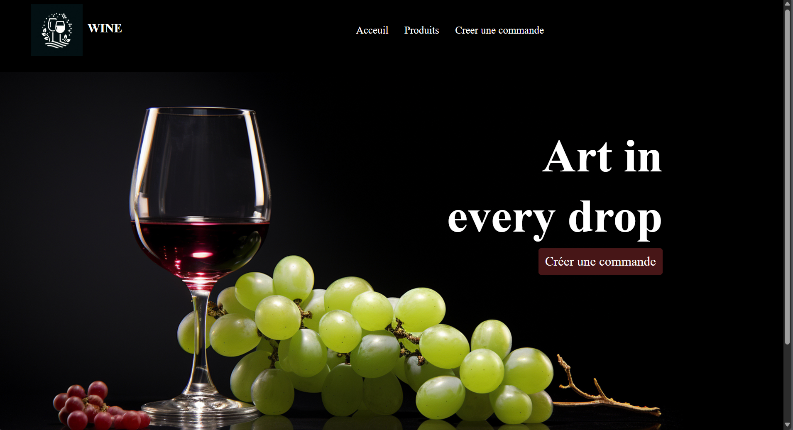
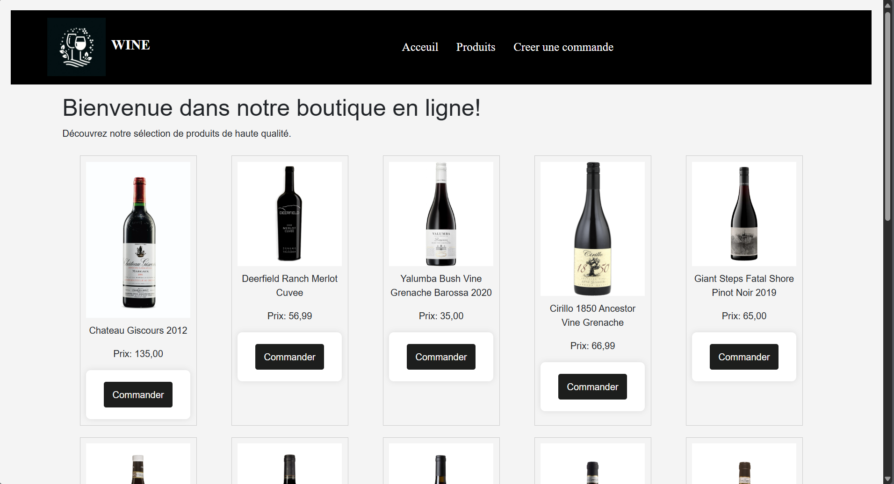
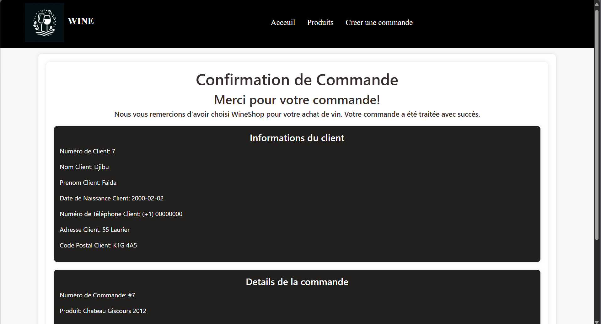

<h1 align="center">🛒 Wine Order – Application de gestion de commandes en ligne</h1>

<p align="center">

  Application web fictive de gestion de commandes d’achat de produits pour une entreprise.<br>
  Réalisée dans le cadre du programme de <b>Technologie du génie informatique</b> au Collège La Cité.
</p>

---

## 🎯 Objectif
Développer une application ASP.NET Core MVC complète permettant à un client de créer une commande en ligne, d’enregistrer les données dans une base de données SQL Server, puis d’afficher une page de confirmation avec les détails de la commande, la date et un numéro unique.

---

## 🧰 Stack technique

<p align="center">
  
  
  
  
  
  
</p>

---

## ✨ Fonctionnalités

- 🏠 **Page d’accueil** : présentation de l’entreprise et accès à la création d’une commande.  
- 🧾 **Création de commande** : formulaire client (nom, prénom, date, téléphone, produit).  
- 💾 **Sauvegarde en base de données** via Entity Framework Core.  
- ✅ **Page de confirmation** affichant le récapitulatif de la commande avec numéro et date.  
- 🎨 **Interface simple et moderne**, responsive grâce à Bootstrap et CSS personnalisé.  

---

## 🖼️ Aperçu du projet

<p align="center">
  
  
  
</p>

---

## 🏗️ Architecture & Structure
```text
PROJET UA2/
├── Controllers/
│   └── CommandeController.cs
├── DAOImplementations/          # implémentations d'accès aux données
├── IDAOInterfaces/              # interfaces (contrats)
├── Models/
│   ├── Client.cs
│   ├── Produit.cs
│   ├── Commande.cs
│   └── ConfirmationCommandeViewModel.cs
├── Views/
│   ├── Home/Index.cshtml        # page principale
│   └── Commande/
│       ├── Create.cshtml        # formulaire
│       └── Confirmation.cshtml  # récapitulatif
├── Migrations/
├── images/                      # Aperçu de l’interface
├── wwwroot/                     # assets (css/js/img)
├── AppDbContext.cs
├── appsettings.json
├── Program.cs / Startup.cs
└── Projet UA2.sln
````
---


## ⚙️ Installation

```bash
# 1. Cloner le projet
git clone https://github.com/faida4/wine-order-mvc.git
cd Projet-UA2

# 2. Restaurer les dépendances
dotnet restore

# 3. Mettre à jour la base de données
dotnet ef database update

# 4. Lancer l’application
dotnet run
